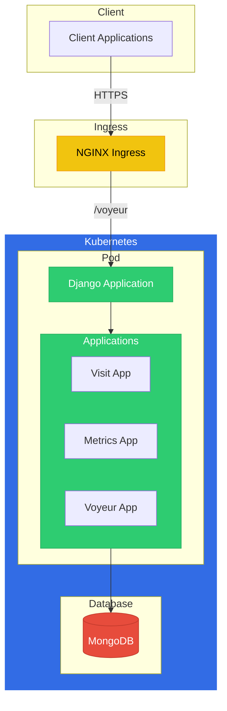

# Voyeur

這是一個用於收集和提供指標數據的後端服務。

# Voyeur API

## Technical Architecture



## API Endpoints

### Visit API
- `GET /visit/count` - Get visit count
- `POST /visit/increment` - Increment visit count

### Swagger Documentation
- `http://127.0.0.1:8000/voyeur/swagger.json`
- `https://peoplesystem.tatdvsonorth.com/voyeur/swagger.json`

```bash
curl http://127.0.0.1:8000/voyeur/swagger.json
curl http://127.0.0.1:8000/voyeur/count/
curl https://peoplesystem.tatdvsonorth.com/voyeur/swagger.json
curl https://peoplesystem.tatdvsonorth.com/voyeur/count/
```

## Development Setup

1. Install dependencies:
```bash
poetry install
```

2. Set up environment variables:
```bash
cp .env.example .env
# Edit .env with your configuration
```

3. Run migrations:
```bash
poetry run python manage.py migrate
```

4. Start development server:
```bash
poetry run python manage.py runserver
```


## WebSocket Connection

Test WebSocket connection using wscat:
```bash
wscat -c ws://localhost:8000/ws/metrics/
```

## Django User
```bash
poetry run python manage.py createsuperuser
```

DEBUG:voyeur.settings:ALLOWED_HOSTS: ['*']
Username (leave blank to use 'vinskao'): 
Email address: tianyikao@gmail.com